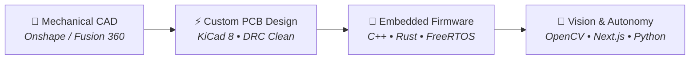

 

 

| 🏆 Houston Worlds | 🥇 NJ Championship | 🤝 STEM Leadership | ⚡ Custom Electronics | 🖨️ Additive Builds |
| :---: | :---: | :---: | :---: | :---: |
| **39th Division Rank** | **Finalist Captain • 5-0** | **500+ Mentoring Hrs • 2.7k+ Reached** | **79-Part Carrier PCB** | **12 CAD Revisions** |

---

### ⚡ About Me

I design and build physical systems from first principles — mechanical CAD, custom PCB layout, embedded control firmware, and modern agentic software.

- 🤖 **Founder & Captain, FIRST Tech Challenge Team 23786 "MakEMinds"**: Led team across mechanical architecture, CNC/3D fabrication, and autonomous control. Built autonomous navigation using **Pedro Pathing with Bézier Curves & de Casteljau splines**, Limelight 3A vision tracking, and closed-loop PID velocity control. Won **1st Place at NJ State Championship (5-0)**, won **NJ University Cup**, and competed at the **FIRST World Championship in Houston** (finishing 39th in the Ross Division).
- 🤝 **Community & Mentorship**: Dedicated **500+ mentoring hours** across 4 FLL teams and founded FTC Team PulseDrive. Hosted 15 STEM outreach events reaching **2,700+ students**, raised **$9,600+** in corporate sponsorships, and represented New Jersey at the US Governor's Cup.
- 🦅 **Director of External Relations, FIRST Robotics Competition Team 2554 "Warhawks"**: Lead corporate sponsorships, engineering partnerships, and team brand strategy.
- 🛠️ **Full-Stack Physical Engineering**: From scratch-built Cartesian 3D printers and multi-tool toolchangers to custom 4-legged quadruped robots, 6-axis arm carrier PCBs, and autonomous quadcopter flight controllers.

---

### 🔬 Active Hardware & Systems Pipeline

---

### 🚀 Flagship Engineering Projects

| Project | Focus | Description | Stack |
| :--- | :--- | :--- | :--- |
| [**roboPet**](https://github.com/AryaVora621/roboPet) | Robotics & AI | Autonomous 4-legged quadruped robot dog. Dual-processor architecture: Raspberry Pi Pico (real-time inverse kinematics & gait) + Raspberry Pi Zero 2W (local vision & speech pipeline), dual XL4016 buck regulation, OnShape CAD, printed on Bambu Lab A1 Mini. |    |
| [**Gerald Rev 2**](https://github.com/AryaVora621/gerald) | Robotics & PCB | Custom ESP32-S3 carrier board for a 6-axis robotic arm with 6x STS3215 serial bus servos. 79 components, 12V 10A servo bus, synchronous buck converter, DRC-clean layout. |    |
| [**ESP32 QuadX Drone**](https://github.com/AryaVora621/drone) | Aerospace | Custom quadcopter flight controller and handheld 2.4GHz joystick transmitter with low-latency telemetry and clamped throttle mapping. |   |
| [**Orochi Toolchanger**](https://github.com/AryaVora621/orochi) | Mechatronics | Multi-tool CoreXY 3D printer evolution built on Ender 5 Pro with Klipper, StealthChanger toolchanger, and custom kinematic toolheads. |   |
| [**M.I.R.A.**](https://github.com/AryaVora621/m.i.r.a) | Room AI & Vision | Interactive room assistant with sub-pixel ArUco projector auto-homography calibration (0.0px error), Rust daemon, and local voice loop. |   |
| [**Nana E-Book Reader**](https://github.com/AryaVora621/nana-ebook-reader) | Accessibility & Embedded | Offline accessibility reading device on Raspberry Pi Zero 2W featuring camera text capture, OpenCV preprocessing, Tesseract OCR, and Piper Neural TTS audio playback. |   |
| [**notchTerm**](https://github.com/AryaVora621/notchTerm) | Systems & macOS | MacBook notch-overlay companion visualizer providing glanceable terminal monitoring, process statuses, and system HUD. |   |
| [**SmartInvest**](https://github.com/AryaVora621/SmartInvest) | Fintech & AI | Full-stack equity intelligence dashboard with streaming AI market analysis, emerging markets stock screening, and guest-first architecture. |   |
| [**aryavora.com**](https://github.com/AryaVora621/aryavora.com) | Web & Graphics | Personal portfolio and engineering lab showcase with 3D interactions, smooth physics, and Playwright verification. |   |

---

### 🛠️ Technical Arsenal

| Domain | Stack & Tooling |
| :--- | :--- |
| **Mechanical & CAD** |     FDM 3D Printing, Motion Systems, Metal Fabrication |
| **Electronics & PCB** |     Power Electronics (Buck/LDO), Stepper/Servo Drivers, SMD Soldering |
| **Embedded & Firmware** |     MicroPython, ESP-IDF, UART, SPI, I2C, ESP-NOW |
| **Software & AI** |    -007396?style=flat-square&logo=openjdk&logoColor=white)   Linux |

---

### 📊 GitHub Activity

---

### 📬 Connect With Me

