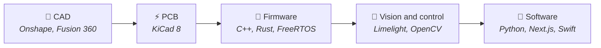

 

 

| 🏆 Worlds | 🥇 NJ State | 🤝 Mentoring | ⚡ PCB | 🖨️ CAD |
| :---: | :---: | :---: | :---: | :---: |
| **Houston, 39th in division** | **Won it as captain, 5-0** | **500+ hrs, 2,700+ students** | **79-part arm controller** | **12 revisions on one build** |

---

### About me

I'm a junior (class of 2028) at John P. Stevens High School in Edison, NJ. I like building robots and doing every part of it myself: the CAD, the circuit boards, the firmware, and the code that ties it together.

- **FTC Team 23786 "MakEMinds":** I started the team and captain it. We won the NJ State Championship, won the NJ University Cup, and went to the FIRST World Championship in Houston. I mostly work on autonomous (Pedro Pathing, Limelight vision, PID on the flywheels).
- **FRC Team 2554 "The Warhawks":** board member. I handle sponsorships, strategy and scouting for a team of 50+.
- **Mentoring:** 500+ hours across four FLL teams, 15 outreach events, $15,000+ raised in sponsorships, and a second FTC team (PulseDrive) that I got off the ground.

---

### How I build things

```mermaid
graph LR
    CAD["📐 CAD<br/><i>Onshape, Fusion 360</i>"] --> PCB["⚡ PCB<br/><i>KiCad 8</i>"]
    PCB --> EMB["🔌 Firmware<br/><i>C++, Rust, FreeRTOS</i>"]
    EMB --> AUT["🎯 Vision and control<br/><i>Limelight, OpenCV</i>"]
    AUT --> SYS["🧠 Software<br/><i>Python, Next.js, Swift</i>"]
```

---

### Projects

| Project | What it is | Stack |
| :--- | :--- | :--- |
| [**roboPet**](https://github.com/AryaVora621/roboPet) | A four-legged robot dog. A Pi Pico handles gait and inverse kinematics, a Pi Zero 2W handles vision and speech. Printed on a Bambu A1 Mini. |    |
| [**Gerald Rev 2**](https://github.com/AryaVora621/gerald) | Custom ESP32-S3 carrier board for a 6-axis arm with six STS3215 servos. 79 parts, 12V 10A servo bus, DRC-clean. |    |
| [**ESP32 QuadX Drone**](https://github.com/AryaVora621/drone) | A quadcopter flight controller plus a handheld 2.4GHz joystick transmitter, talking over ESP-NOW. |   |
| [**Orochi Toolchanger**](https://github.com/AryaVora621/orochi) | An Ender 5 Pro rebuilt as a CoreXY toolchanger with Klipper and StealthChanger docks. |   |
| [**M.I.R.A.**](https://github.com/AryaVora621/m.i.r.a) | A room assistant that lines up a projector and camera using ArUco markers. Rust daemon, local voice. |   |
| [**Nana E-Book Reader**](https://github.com/AryaVora621/nana-ebook-reader) | An offline reading device for accessibility. Camera, OCR and text-to-speech on a Pi Zero 2W. |   |
| [**notchTerm**](https://github.com/AryaVora621/notchTerm) | A macOS notch overlay that shows terminal and process status at a glance. |   |
| [**SmartInvest**](https://github.com/AryaVora621/SmartInvest) | A stock research dashboard with streaming AI analysis and a screener for emerging markets. |   |
| [**arya-vora.org**](https://github.com/AryaVora621/aryavora.com) | My portfolio site, with 3D interactions built in Three.js. |   |

<b>FTC robot: how the autonomous works</b>

 

- **Pathing:** Pedro Pathing, which follows Bézier curves so the robot moves smoothly instead of stopping at every waypoint.
- **Vision:** a Limelight 3A reads AprilTags and corrects odometry drift during a match.
- **Flywheels:** a PID loop adjusts RPM for battery sag and distance to the goal.
- **Mechanisms:** a Mecanum intake, a motorized indexer, and an adjustable-angle hood over two weighted flywheels.

<b>Gerald Rev 2: the board</b>

 

- ESP32-S3 with dedicated UART buses for the serial servos.
- 12V 10A bus with an onboard synchronous buck converter.
- Star grounding to keep logic and power separate, TVS diode for reverse-voltage protection, LC filtering for ripple.
- Routed entirely in KiCad 8 with zero DRC errors.

---

### Tools

| | |
| :--- | :--- |
| **CAD and fab** |     |
| **Electronics** |     |
| **Firmware** |     |
| **Software** |     -007396?style=flat-square&logo=openjdk&logoColor=white)  |

---

  

